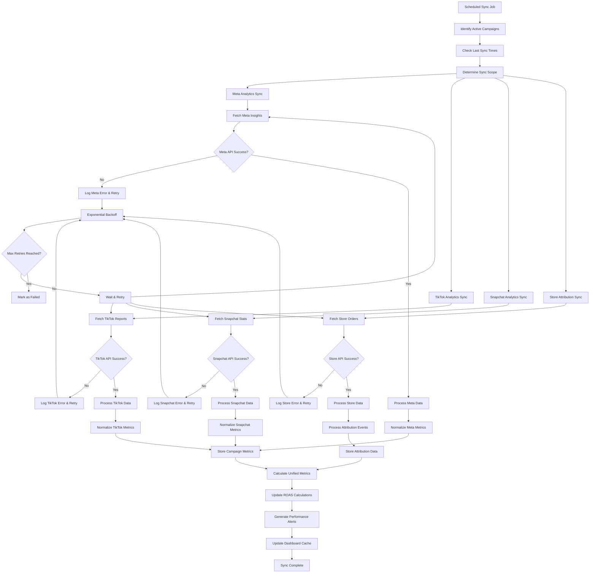

# Analytics Syncing Flow

## Overview
This document describes the process of collecting, processing, and synchronizing performance data from multiple advertising platforms and e-commerce stores to provide unified analytics.

## Flow Diagram



## Platform-Specific Data Collection

### Meta (Facebook/Instagram) Analytics

#### 1. Insights API Integration
```python
async def fetch_meta_insights(ad_account_id, campaign_ids, date_range):
    """Fetch insights from Meta Marketing API"""
    
    fields = [
        'impressions',
        'clicks', 
        'spend',
        'conversions',
        'conversion_values',
        'ctr',
        'cpc',
        'cpm',
        'frequency',
        'reach'
    ]
    
    params = {
        'fields': ','.join(fields),
        'time_range': {
            'since': date_range['start'],
            'until': date_range['end']
        },
        'time_increment': 1,  # Daily breakdown
        'level': 'campaign',
        'filtering': [
            {
                'field': 'campaign.id',
                'operator': 'IN',
                'value': campaign_ids
            }
        ]
    }
    
    try:
        response = await meta_api.get_insights(ad_account_id, params)
        return process_meta_insights(response['data'])
    except Exception as e:
        logger.error(f"Meta insights fetch failed: {e}")
        raise
```

#### 2. Data Processing
```python
def process_meta_insights(raw_data):
    """Process and normalize Meta insights data"""
    processed_data = []
    
    for insight in raw_data:
        processed_data.append({
            'external_campaign_id': insight['campaign_id'],
            'date': insight['date_start'],
            'impressions': int(insight.get('impressions', 0)),
            'clicks': int(insight.get('clicks', 0)),
            'spend': float(insight.get('spend', 0)),
            'conversions': int(insight.get('conversions', 0)),
            'conversion_value': float(insight.get('conversion_values', 0)),
            'ctr': float(insight.get('ctr', 0)),
            'cpc': float(insight.get('cpc', 0)),
            'cpm': float(insight.get('cpm', 0)),
            'platform': 'meta'
        })
    
    return processed_data
```

### TikTok Analytics

#### 1. Reporting API Integration
```python
async def fetch_tiktok_reports(advertiser_id, campaign_ids, date_range):
    """Fetch reports from TikTok Marketing API"""
    
    metrics = [
        'impressions',
        'clicks',
        'spend',
        'conversions',
        'conversion_cost',
        'ctr',
        'cpc',
        'cpm',
        'video_play_actions',
        'video_watched_2s',
        'video_watched_6s'
    ]
    
    params = {
        'advertiser_id': advertiser_id,
        'report_type': 'BASIC',
        'data_level': 'AUCTION_CAMPAIGN',
        'dimensions': ['campaign_id', 'stat_time_day'],
        'metrics': metrics,
        'start_date': date_range['start'],
        'end_date': date_range['end'],
        'filters': [
            {
                'field_name': 'campaign_ids',
                'filter_type': 'IN',
                'filter_value': campaign_ids
            }
        ]
    }
    
    try:
        # Create async report
        report_response = await tiktok_api.create_report(params)
        report_id = report_response['data']['task_id']
        
        # Poll for completion
        report_data = await poll_tiktok_report(report_id)
        return process_tiktok_data(report_data)
        
    except Exception as e:
        logger.error(f"TikTok report fetch failed: {e}")
        raise
```

#### 2. Async Report Polling
```python
async def poll_tiktok_report(report_id, max_attempts=30):
    """Poll TikTok report until completion"""
    
    for attempt in range(max_attempts):
        status_response = await tiktok_api.get_report_status(report_id)
        status = status_response['data']['status']
        
        if status == 'SUCCESS':
            # Download report data
            data_response = await tiktok_api.get_report_data(report_id)
            return data_response['data']['list']
        elif status == 'FAILED':
            raise Exception("TikTok report generation failed")
        
        # Wait before next poll
        await asyncio.sleep(10)
    
    raise Exception("TikTok report polling timeout")
```

### Snapchat Analytics

#### 1. Stats API Integration
```python
async def fetch_snapchat_stats(ad_account_id, campaign_ids, date_range):
    """Fetch stats from Snapchat Marketing API"""
    
    granularity = 'DAY'
    fields = [
        'impressions',
        'swipes',
        'spend',
        'conversion_purchases',
        'conversion_purchases_value',
        'swipe_up_percent',
        'video_views',
        'quartile_1',
        'quartile_2', 
        'quartile_3',
        'view_completion'
    ]
    
    params = {
        'granularity': granularity,
        'fields': ','.join(fields),
        'start_time': date_range['start'],
        'end_time': date_range['end'],
        'swipe_up_attribution_window': '7_DAY',
        'view_attribution_window': '1_DAY'
    }
    
    try:
        stats_data = []
        for campaign_id in campaign_ids:
            response = await snapchat_api.get_campaign_stats(
                campaign_id, params
            )
            stats_data.extend(response['timeseries_stats'])
        
        return process_snapchat_stats(stats_data)
        
    except Exception as e:
        logger.error(f"Snapchat stats fetch failed: {e}")
        raise
```

## E-Commerce Attribution Sync

### Store Order Processing
```python
async def sync_store_attribution(store_connection_id, date_range):
    """Sync orders and attribution data from e-commerce stores"""
    
    store = await get_store_connection(store_connection_id)
    
    if store.platform == 'shopify':
        orders = await fetch_shopify_orders(store, date_range)
    elif store.platform == 'woocommerce':
        orders = await fetch_woocommerce_orders(store, date_range)
    elif store.platform == 'salla':
        orders = await fetch_salla_orders(store, date_range)
    elif store.platform == 'zid':
        orders = await fetch_zid_orders(store, date_range)
    
    # Process attribution for each order
    attribution_events = []
    for order in orders:
        attribution = await process_order_attribution(order)
        if attribution:
            attribution_events.append(attribution)
    
    # Store attribution events
    await store_attribution_events(attribution_events)
    
    return len(attribution_events)
```

### Attribution Processing
```python
async def process_order_attribution(order):
    """Extract and process attribution data from order"""
    
    attribution_data = order.get('attribution_data', {})
    
    # Extract UTM parameters
    utm_params = {
        'utm_source': attribution_data.get('utm_source'),
        'utm_medium': attribution_data.get('utm_medium'),
        'utm_campaign': attribution_data.get('utm_campaign'),
        'utm_content': attribution_data.get('utm_content'),
        'utm_term': attribution_data.get('utm_term')
    }
    
    # Find matching campaign
    campaign = await find_campaign_by_utm(utm_params)
    
    if campaign:
        return {
            'workspace_id': campaign.workspace_id,
            'campaign_id': campaign.id,
            'order_id': order['id'],
            'event_type': 'conversion',
            'platform': campaign.platform,
            'utm_source': utm_params['utm_source'],
            'utm_medium': utm_params['utm_medium'],
            'utm_campaign': utm_params['utm_campaign'],
            'utm_content': utm_params['utm_content'],
            'utm_term': utm_params['utm_term'],
            'referrer': attribution_data.get('referrer'),
            'conversion_value': float(order['total_amount']),
            'event_time': order['order_date']
        }
    
    return None
```

## Data Normalization & Storage

### Metric Normalization
```python
def normalize_platform_metrics(platform_data, platform):
    """Normalize metrics across different platforms"""
    
    normalized_metrics = []
    
    for data_point in platform_data:
        # Map platform-specific metrics to unified schema
        if platform == 'meta':
            normalized = {
                'impressions': data_point['impressions'],
                'clicks': data_point['clicks'],
                'spend': data_point['spend'],
                'conversions': data_point['conversions'],
                'conversion_value': data_point['conversion_value']
            }
        elif platform == 'tiktok':
            normalized = {
                'impressions': data_point['impressions'],
                'clicks': data_point['clicks'],
                'spend': data_point['spend'],
                'conversions': data_point['conversions'],
                'conversion_value': data_point.get('conversion_cost', 0)
            }
        elif platform == 'snapchat':
            normalized = {
                'impressions': data_point['impressions'],
                'clicks': data_point['swipes'],  # Snapchat uses 'swipes'
                'spend': data_point['spend'],
                'conversions': data_point['conversion_purchases'],
                'conversion_value': data_point['conversion_purchases_value']
            }
        
        # Calculate derived metrics
        normalized.update({
            'ctr': calculate_ctr(normalized['clicks'], normalized['impressions']),
            'cpc': calculate_cpc(normalized['spend'], normalized['clicks']),
            'cpm': calculate_cpm(normalized['spend'], normalized['impressions']),
            'roas': calculate_roas(normalized['conversion_value'], normalized['spend'])
        })
        
        normalized_metrics.append(normalized)
    
    return normalized_metrics
```

### Database Storage
```python
async def store_campaign_metrics(campaign_id, date, metrics):
    """Store normalized metrics in database"""
    
    query = """
    INSERT INTO campaign_metrics (
        campaign_id, date, impressions, clicks, spend, 
        conversions, revenue, ctr, cpc, cpm, roas
    ) VALUES ($1, $2, $3, $4, $5, $6, $7, $8, $9, $10, $11)
    ON CONFLICT (campaign_id, date) 
    DO UPDATE SET
        impressions = EXCLUDED.impressions,
        clicks = EXCLUDED.clicks,
        spend = EXCLUDED.spend,
        conversions = EXCLUDED.conversions,
        revenue = EXCLUDED.revenue,
        ctr = EXCLUDED.ctr,
        cpc = EXCLUDED.cpc,
        cpm = EXCLUDED.cpm,
        roas = EXCLUDED.roas,
        updated_at = CURRENT_TIMESTAMP
    """
    
    await db.execute(query, 
        campaign_id, date, metrics['impressions'], metrics['clicks'],
        metrics['spend'], metrics['conversions'], metrics['conversion_value'],
        metrics['ctr'], metrics['cpc'], metrics['cpm'], metrics['roas']
    )
```

## ROAS & Revenue Calculation

### Cross-Platform ROAS
```python
async def calculate_unified_roas(workspace_id, date_range):
    """Calculate ROAS across all platforms and campaigns"""
    
    # Get all campaign metrics for the period
    campaign_metrics = await get_campaign_metrics(workspace_id, date_range)
    
    # Get attribution events (conversions from stores)
    attribution_events = await get_attribution_events(workspace_id, date_range)
    
    total_spend = sum(metric['spend'] for metric in campaign_metrics)
    total_revenue = sum(event['conversion_value'] for event in attribution_events)
    
    # Calculate platform-specific ROAS
    platform_roas = {}
    for platform in ['meta', 'tiktok', 'snapchat']:
        platform_spend = sum(
            metric['spend'] for metric in campaign_metrics 
            if metric['platform'] == platform
        )
        platform_revenue = sum(
            event['conversion_value'] for event in attribution_events
            if event['platform'] == platform
        )
        
        if platform_spend > 0:
            platform_roas[platform] = platform_revenue / platform_spend
        else:
            platform_roas[platform] = 0
    
    # Overall ROAS
    overall_roas = total_revenue / total_spend if total_spend > 0 else 0
    
    return {
        'overall_roas': overall_roas,
        'platform_roas': platform_roas,
        'total_spend': total_spend,
        'total_revenue': total_revenue
    }
```

### Attribution Window Handling
```python
def apply_attribution_window(conversion_events, click_events, window_days=7):
    """Apply attribution window to match conversions with clicks"""
    
    attributed_conversions = []
    
    for conversion in conversion_events:
        conversion_time = conversion['event_time']
        
        # Find clicks within attribution window
        relevant_clicks = [
            click for click in click_events
            if (conversion_time - click['event_time']).days <= window_days
            and click['campaign_id'] == conversion['campaign_id']
        ]
        
        if relevant_clicks:
            # Attribute to last click (last-touch attribution)
            last_click = max(relevant_clicks, key=lambda x: x['event_time'])
            
            attributed_conversions.append({
                **conversion,
                'attributed_click_id': last_click['id'],
                'attribution_type': 'last_click'
            })
    
    return attributed_conversions
```

## Performance Alerts & Monitoring

### Alert Conditions
```python
async def check_performance_alerts(campaign_id, current_metrics, historical_metrics):
    """Check for performance alerts based on thresholds"""
    
    alerts = []
    
    # ROAS drop alert
    if (current_metrics['roas'] < historical_metrics['avg_roas'] * 0.7 
        and current_metrics['spend'] > 100):
        alerts.append({
            'type': 'roas_drop',
            'severity': 'high',
            'message': f"ROAS dropped to {current_metrics['roas']:.2f} (avg: {historical_metrics['avg_roas']:.2f})",
            'campaign_id': campaign_id
        })
    
    # High spend, low conversions
    if (current_metrics['spend'] > historical_metrics['avg_spend'] * 1.5 
        and current_metrics['conversions'] < historical_metrics['avg_conversions'] * 0.5):
        alerts.append({
            'type': 'high_spend_low_conversions',
            'severity': 'medium',
            'message': "High spend with low conversions detected",
            'campaign_id': campaign_id
        })
    
    # CTR drop
    if current_metrics['ctr'] < historical_metrics['avg_ctr'] * 0.5:
        alerts.append({
            'type': 'ctr_drop',
            'severity': 'low',
            'message': f"CTR dropped to {current_metrics['ctr']:.2f}%",
            'campaign_id': campaign_id
        })
    
    return alerts
```

### Dashboard Cache Updates
```python
async def update_dashboard_cache(workspace_id):
    """Update cached dashboard data for fast loading"""
    
    # Calculate key metrics for different time periods
    time_periods = ['today', '7_days', '30_days', '90_days']
    
    cache_data = {}
    
    for period in time_periods:
        date_range = get_date_range_for_period(period)
        
        metrics = await calculate_unified_metrics(workspace_id, date_range)
        cache_data[period] = {
            'total_spend': metrics['total_spend'],
            'total_revenue': metrics['total_revenue'],
            'roas': metrics['roas'],
            'impressions': metrics['impressions'],
            'clicks': metrics['clicks'],
            'conversions': metrics['conversions'],
            'ctr': metrics['ctr'],
            'cpc': metrics['cpc']
        }
    
    # Store in Redis cache
    cache_key = f"dashboard_metrics:{workspace_id}"
    await redis.setex(cache_key, 3600, json.dumps(cache_data))  # 1 hour TTL
```

## Error Handling & Recovery

### Sync Failure Recovery
```python
async def handle_sync_failure(platform, campaign_id, error, attempt_count):
    """Handle sync failures with appropriate recovery strategy"""
    
    if attempt_count >= MAX_RETRY_ATTEMPTS:
        # Mark as failed and alert admins
        await mark_sync_failed(platform, campaign_id, error)
        await send_admin_alert(f"Sync failed for {platform} campaign {campaign_id}")
        return False
    
    # Determine retry strategy based on error type
    if error.code == 'RATE_LIMIT':
        # Wait for rate limit reset
        wait_time = error.retry_after or 3600  # 1 hour default
        await schedule_retry_sync(platform, campaign_id, wait_time)
    elif error.code == 'TOKEN_EXPIRED':
        # Try to refresh token
        success = await refresh_platform_token(platform)
        if success:
            await schedule_retry_sync(platform, campaign_id, 300)  # 5 minutes
        else:
            await request_user_reauth(platform)
    elif error.code == 'TEMPORARY_ERROR':
        # Exponential backoff
        wait_time = (2 ** attempt_count) * 60  # Minutes
        await schedule_retry_sync(platform, campaign_id, wait_time)
    else:
        # Permanent error - don't retry
        await mark_sync_failed(platform, campaign_id, error)
        return False
    
    return True
```

### Data Consistency Checks
```python
async def validate_sync_data_consistency(workspace_id, date_range):
    """Validate data consistency across platforms and stores"""
    
    issues = []
    
    # Check for missing data
    campaigns = await get_active_campaigns(workspace_id, date_range)
    for campaign in campaigns:
        metrics = await get_campaign_metrics(campaign.id, date_range)
        if not metrics:
            issues.append({
                'type': 'missing_metrics',
                'campaign_id': campaign.id,
                'platform': campaign.platform
            })
    
    # Check for data anomalies
    for campaign in campaigns:
        metrics = await get_campaign_metrics(campaign.id, date_range)
        if metrics:
            # Check for impossible values
            if metrics['ctr'] > 100:  # CTR > 100%
                issues.append({
                    'type': 'invalid_ctr',
                    'campaign_id': campaign.id,
                    'value': metrics['ctr']
                })
            
            if metrics['roas'] > 1000:  # ROAS > 1000x
                issues.append({
                    'type': 'suspicious_roas',
                    'campaign_id': campaign.id,
                    'value': metrics['roas']
                })
    
    return issues
```