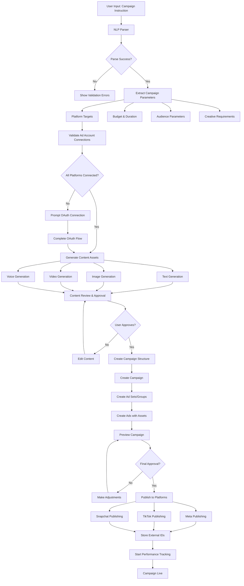

# Campaign Creation Flow

## Overview
This document describes the complete flow for creating and publishing campaigns in the ADLY platform.

## Flow Diagram



## Detailed Steps

### 1. User Input Processing
```
Input: "Create Instagram and TikTok campaign for Ramadan sale with 1000 SAR budget targeting women 25-40 in Riyadh"

Parser extracts:
- Platforms: [Instagram, TikTok]
- Theme: Ramadan
- Budget: 1000 SAR
- Target: Women, 25-40, Riyadh
- Objective: Sales (inferred)
```

### 2. Parameter Validation
- Check budget constraints
- Validate audience parameters
- Verify platform availability
- Confirm ad account permissions

### 3. Content Generation Pipeline
```
Parallel Generation:
├── Headlines (Arabic + English)
├── Descriptions (Arabic + English)  
├── CTAs (Arabic + English)
├── Images (Ramadan theme)
├── Videos (Product showcase)
└── Voiceovers (Arabic female voice)
```

### 4. Campaign Structure Creation
```
Campaign
├── Meta Campaign
│   ├── Ad Set 1 (Women 25-35)
│   │   └── Ad 1 (Image + Text)
│   └── Ad Set 2 (Women 35-40)
│       └── Ad 1 (Video + Text)
└── TikTok Campaign
    └── Ad Group 1 (Women 25-40)
        └── Ad 1 (Video + Text)
```

### 5. Platform Publishing
- **Meta**: Campaign → Ad Set → Ad
- **TikTok**: Campaign → Ad Group → Ad  
- **Snapchat**: Campaign → Ad Squad → Ad

### 6. Error Handling
```
Common Errors:
├── Insufficient budget
├── Invalid targeting
├── Content policy violations
├── API rate limits
├── Token expiration
└── Platform-specific errors
```

### 7. Success Tracking
- Store external campaign IDs
- Set up performance monitoring
- Initialize attribution tracking
- Schedule sync jobs

## API Endpoints Used

1. `POST /workspaces/{id}/campaigns/parse` - Parse instruction
2. `POST /workspaces/{id}/generate/text` - Generate text content
3. `POST /workspaces/{id}/generate/image` - Generate images
4. `POST /workspaces/{id}/generate/video` - Generate videos
5. `POST /workspaces/{id}/campaigns` - Create campaign
6. `POST /workspaces/{id}/campaigns/{id}/publish` - Publish campaign

## Database Updates

### Campaign Creation
```sql
INSERT INTO campaigns (workspace_id, ad_account_id, name, objective, budget_amount, ...)
INSERT INTO ad_sets (campaign_id, name, targeting, ...)
INSERT INTO ads (ad_set_id, name, creative_data, media_assets, ...)
```

### Asset Storage
```sql
INSERT INTO content_assets (workspace_id, type, file_url, metadata, ...)
INSERT INTO generation_jobs (workspace_id, type, status, result_asset_id, ...)
```

## Background Jobs

### Immediate Jobs
- Content generation (async)
- Platform publishing (async)
- Asset optimization

### Scheduled Jobs
- Performance sync (hourly)
- Token refresh (daily)
- Campaign status updates (every 15 minutes)

## Error Recovery

### Content Generation Failures
1. Retry with different provider
2. Use fallback templates
3. Request manual content creation

### Publishing Failures
1. Retry with exponential backoff
2. Check token validity
3. Validate campaign parameters
4. Notify user of issues

## Performance Considerations

- **Parallel Processing**: Generate all content types simultaneously
- **Caching**: Cache generated content for reuse
- **Rate Limiting**: Respect platform API limits
- **Batch Operations**: Group similar API calls
- **Async Processing**: Use Celery for long-running tasks

## Security Measures

- **Token Encryption**: Encrypt stored access tokens
- **Permission Checks**: Verify user permissions at each step
- **Audit Logging**: Log all campaign creation activities
- **Input Validation**: Sanitize all user inputs
- **Rate Limiting**: Prevent abuse of generation APIs