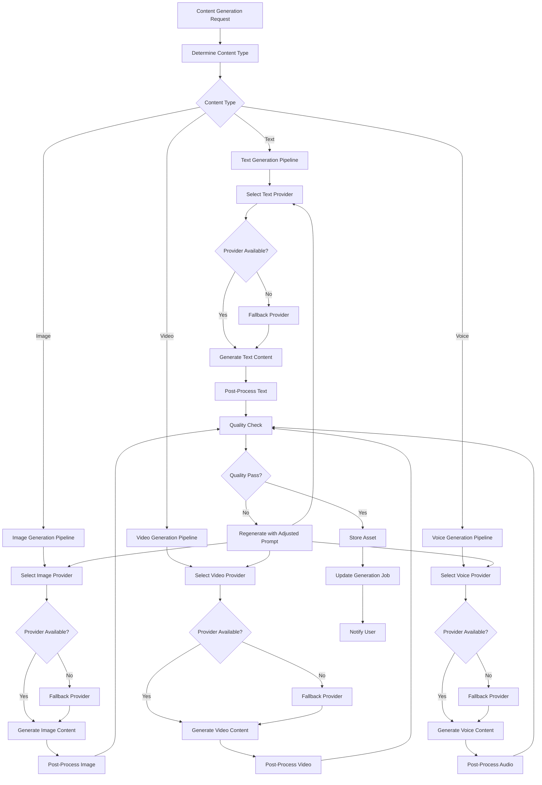

# Content Generation Flow

## Overview
This document describes the AI-powered content generation pipeline for creating marketing assets in Arabic and English.

## Flow Diagram



## Text Generation Pipeline

### 1. Provider Selection
```
Primary: OpenAI GPT-4
Fallback: Anthropic Claude
Emergency: Template-based generation
```

### 2. Prompt Engineering
```
Arabic Marketing Prompt:
"أنشئ عنوان إعلاني جذاب باللغة العربية لـ {product_name} 
في مناسبة {theme} يستهدف {target_audience}
الطول: {max_length} حرف
النبرة: {tone} (حماسية، أنيقة، ودودة)
يجب أن يتضمن: {requirements}"

English Marketing Prompt:
"Create an engaging {content_type} for {product_name}
Theme: {theme}
Target: {target_audience}
Length: {max_length} characters
Tone: {tone}
Requirements: {requirements}"
```

### 3. Content Types
- **Headlines**: 30-60 characters
- **Descriptions**: 100-300 characters  
- **CTAs**: 10-25 characters
- **Product Descriptions**: 500-1000 characters

### 4. Quality Checks
- Language detection
- Character count validation
- Profanity filtering
- Cultural sensitivity check
- Brand guideline compliance

## Image Generation Pipeline

### 1. Provider Selection
```
Primary: Midjourney (via API)
Secondary: DALL-E 3
Fallback: Stable Diffusion
Template: Pre-designed templates
```

### 2. Prompt Construction
```
Arabic Context Prompt:
"Create a modern Arabic marketing image for {product_name}
Style: {style} (modern, traditional, minimalist)
Colors: {brand_colors}
Text overlay: '{arabic_text}' in Arabic calligraphy
Dimensions: {width}x{height}
Cultural context: {theme} (Ramadan, Eid, National Day)
No people if targeting conservative audience"

Product Showcase Prompt:
"Professional product photography of {product_name}
Background: {background_style}
Lighting: {lighting_type}
Angle: {camera_angle}
Include: {props}
Style: {aesthetic}"
```

### 3. Image Processing
- Resize to platform requirements
- Add Arabic text overlays
- Apply brand colors/filters
- Optimize for web delivery
- Generate multiple variations

### 4. Platform Specifications
```
Instagram Feed: 1080x1080
Instagram Stories: 1080x1920
TikTok: 1080x1920
Snapchat: 1080x1920
Facebook Feed: 1200x630
```

## Video Generation Pipeline

### 1. Provider Selection
```
Primary: Runway ML
Secondary: Pika Labs
Fallback: Template-based assembly
```

### 2. Video Assembly Process
```
Scene 1: Product Introduction (3s)
├── Product showcase
├── Arabic text overlay
└── Background music

Scene 2: Benefits Highlight (5s)
├── Feature demonstration
├── Benefit callouts
└── Transition effects

Scene 3: Call to Action (2s)
├── CTA text
├── Contact information
└── Brand logo
```

### 3. Template System
```
Templates by Category:
├── Fashion (Traditional, Modern)
├── Electronics (Tech, Gadgets)
├── Food (Restaurant, Delivery)
├── Services (Professional, Personal)
└── Seasonal (Ramadan, Eid, National Day)
```

### 4. Video Specifications
- Duration: 15-60 seconds
- Resolution: 1080p minimum
- Format: MP4 (H.264)
- Aspect ratios: 16:9, 9:16, 1:1
- Subtitles: Arabic and English

## Voice Generation Pipeline

### 1. Provider Selection
```
Primary: ElevenLabs (Arabic voices)
Secondary: Murf AI
Fallback: Azure Speech Services
```

### 2. Voice Options
```
Arabic Voices:
├── Female Professional (Formal)
├── Female Friendly (Casual)
├── Male Professional (Formal)
└── Male Friendly (Casual)

English Voices:
├── Female Middle Eastern Accent
├── Male Middle Eastern Accent
├── Female Neutral
└── Male Neutral
```

### 3. Script Processing
```
Text Preprocessing:
├── Normalize Arabic text
├── Add pronunciation guides
├── Insert natural pauses
├── Adjust speaking speed
└── Add emphasis markers
```

### 4. Audio Specifications
- Format: MP3, WAV
- Quality: 44.1kHz, 16-bit
- Duration: 10-30 seconds
- Volume normalization
- Background music mixing

## Quality Assurance

### Automated Checks
```python
def quality_check(content, content_type):
    checks = {
        'text': [
            'language_detection',
            'character_count',
            'profanity_filter',
            'cultural_sensitivity'
        ],
        'image': [
            'resolution_check',
            'file_size_limit',
            'content_policy',
            'brand_compliance'
        ],
        'video': [
            'duration_check',
            'resolution_check',
            'audio_quality',
            'subtitle_accuracy'
        ],
        'voice': [
            'audio_quality',
            'duration_check',
            'pronunciation_check',
            'volume_levels'
        ]
    }
    return run_checks(content, checks[content_type])
```

### Manual Review Triggers
- Cultural sensitivity flags
- Brand guideline violations
- Quality score below threshold
- User-reported issues

## Error Handling

### Generation Failures
1. **Provider Timeout**: Switch to fallback provider
2. **Content Policy Violation**: Adjust prompt and retry
3. **Quality Issues**: Regenerate with modified parameters
4. **API Limits**: Queue for later processing

### Recovery Strategies
```python
def handle_generation_error(error_type, attempt_count):
    if error_type == 'provider_timeout':
        return switch_provider()
    elif error_type == 'content_policy':
        return adjust_prompt_and_retry()
    elif error_type == 'quality_low':
        return regenerate_with_higher_quality()
    elif attempt_count > 3:
        return use_template_fallback()
```

## Performance Optimization

### Caching Strategy
- Cache successful prompts
- Store template variations
- Reuse similar content
- CDN for asset delivery

### Parallel Processing
```python
async def generate_campaign_content(campaign_data):
    tasks = [
        generate_headlines(campaign_data),
        generate_images(campaign_data),
        generate_videos(campaign_data),
        generate_voiceovers(campaign_data)
    ]
    results = await asyncio.gather(*tasks)
    return combine_results(results)
```

### Resource Management
- Queue management for high-demand periods
- Load balancing across providers
- Cost optimization algorithms
- Usage tracking and limits

## API Integration

### Generation Request
```json
{
  "type": "image",
  "prompt": "Modern Arabic calligraphy for Eid celebration",
  "parameters": {
    "style": "modern",
    "dimensions": "1080x1080",
    "language": "ar",
    "theme": "eid",
    "brand_colors": ["#1a472a", "#f4d03f"]
  },
  "quality": "high",
  "variations": 3
}
```

### Generation Response
```json
{
  "job_id": "uuid",
  "status": "completed",
  "assets": [
    {
      "id": "uuid",
      "url": "https://cdn.adly.com/assets/image1.jpg",
      "metadata": {
        "dimensions": "1080x1080",
        "file_size": 245760,
        "generation_time": 12.5
      }
    }
  ],
  "usage": {
    "provider": "midjourney",
    "cost": 0.05,
    "credits_used": 1
  }
}
```