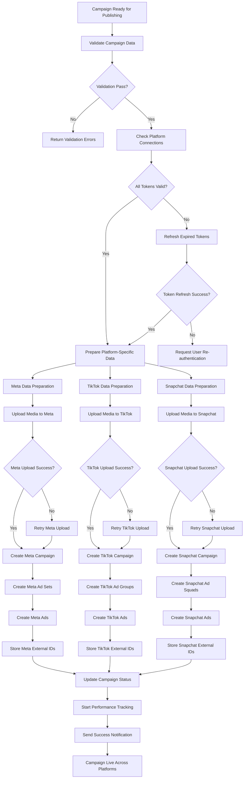

# Platform Publishing Flow

## Overview
This document describes the process of publishing campaigns across multiple advertising platforms (Meta, TikTok, Snapchat) with error handling and synchronization.

## Flow Diagram



## Platform-Specific Publishing

### Meta (Facebook/Instagram) Publishing

#### 1. Data Preparation
```python
def prepare_meta_campaign_data(campaign):
    return {
        "name": campaign.name,
        "objective": map_objective_to_meta(campaign.objective),
        "status": "PAUSED",  # Start paused for review
        "buying_type": "AUCTION",
        "bid_strategy": "LOWEST_COST_WITHOUT_CAP"
    }

def prepare_meta_adset_data(ad_set, campaign_external_id):
    return {
        "name": ad_set.name,
        "campaign_id": campaign_external_id,
        "optimization_goal": "CONVERSIONS",
        "billing_event": "IMPRESSIONS",
        "bid_amount": ad_set.bid_amount,
        "daily_budget": ad_set.budget_amount * 100,  # Convert to cents
        "targeting": format_meta_targeting(ad_set.targeting),
        "status": "PAUSED"
    }
```

#### 2. Media Upload Process
```python
async def upload_media_to_meta(ad_account_id, media_assets):
    uploaded_media = []
    for asset in media_assets:
        if asset.type == 'image':
            response = await meta_api.create_ad_image(
                ad_account_id=ad_account_id,
                filename=asset.filename,
                file_data=asset.file_data
            )
        elif asset.type == 'video':
            response = await meta_api.create_ad_video(
                ad_account_id=ad_account_id,
                filename=asset.filename,
                file_data=asset.file_data
            )
        uploaded_media.append({
            'asset_id': asset.id,
            'external_id': response['id'],
            'hash': response.get('hash')
        })
    return uploaded_media
```

#### 3. Campaign Structure Creation
```
Meta Campaign Hierarchy:
Campaign
├── Ad Set 1 (Audience Segment 1)
│   ├── Ad 1 (Image Creative)
│   └── Ad 2 (Video Creative)
└── Ad Set 2 (Audience Segment 2)
    ├── Ad 1 (Image Creative)
    └── Ad 2 (Video Creative)
```

### TikTok Publishing

#### 1. Data Preparation
```python
def prepare_tiktok_campaign_data(campaign):
    return {
        "campaign_name": campaign.name,
        "objective_type": map_objective_to_tiktok(campaign.objective),
        "budget_mode": "BUDGET_MODE_DAY",
        "budget": campaign.budget_amount,
        "operation_status": "DISABLE"  # Start disabled
    }

def prepare_tiktok_adgroup_data(ad_group, campaign_external_id):
    return {
        "campaign_id": campaign_external_id,
        "adgroup_name": ad_group.name,
        "placement_type": "PLACEMENT_TYPE_AUTOMATIC",
        "budget": ad_group.budget_amount,
        "bid_type": "BID_TYPE_NO_BID",
        "optimization_goal": "CONVERT",
        "targeting": format_tiktok_targeting(ad_group.targeting),
        "operation_status": "DISABLE"
    }
```

#### 2. Creative Upload
```python
async def upload_creative_to_tiktok(advertiser_id, creative_data):
    # Upload video creative
    video_response = await tiktok_api.upload_video(
        advertiser_id=advertiser_id,
        video_file=creative_data['video_file'],
        video_signature=creative_data['video_signature']
    )
    
    # Create ad creative
    creative_response = await tiktok_api.create_creative(
        advertiser_id=advertiser_id,
        creative_type="VIDEO",
        video_id=video_response['video_id'],
        ad_text=creative_data['ad_text'],
        call_to_action=creative_data['cta']
    )
    
    return creative_response['creative_id']
```

### Snapchat Publishing

#### 1. Data Preparation
```python
def prepare_snapchat_campaign_data(campaign):
    return {
        "name": campaign.name,
        "objective": map_objective_to_snapchat(campaign.objective),
        "status": "PAUSED",
        "start_time": campaign.start_date.isoformat(),
        "end_time": campaign.end_date.isoformat() if campaign.end_date else None
    }

def prepare_snapchat_adsquad_data(ad_squad, campaign_external_id):
    return {
        "name": ad_squad.name,
        "campaign_id": campaign_external_id,
        "type": "SNAP_ADS",
        "status": "PAUSED",
        "daily_budget_micro": ad_squad.budget_amount * 1000000,  # Convert to micro currency
        "bid_micro": ad_squad.bid_amount * 1000000,
        "optimization_goal": "SWIPES",
        "targeting": format_snapchat_targeting(ad_squad.targeting)
    }
```

## Error Handling & Recovery

### Common Error Scenarios

#### 1. Authentication Errors
```python
async def handle_auth_error(platform, error):
    if error.code == 'INVALID_TOKEN':
        # Try to refresh token
        success = await refresh_platform_token(platform)
        if success:
            return 'RETRY'
        else:
            return 'REQUIRE_REAUTH'
    elif error.code == 'INSUFFICIENT_PERMISSIONS':
        return 'PERMISSION_ERROR'
    else:
        return 'AUTH_UNKNOWN'
```

#### 2. Content Policy Violations
```python
def handle_content_policy_error(platform, error, creative_data):
    violations = parse_policy_violations(error)
    
    suggestions = []
    for violation in violations:
        if violation.type == 'TEXT_CONTENT':
            suggestions.append('Modify ad text to comply with platform policies')
        elif violation.type == 'IMAGE_CONTENT':
            suggestions.append('Replace image with policy-compliant alternative')
        elif violation.type == 'TARGETING':
            suggestions.append('Adjust targeting parameters')
    
    return {
        'status': 'POLICY_VIOLATION',
        'violations': violations,
        'suggestions': suggestions
    }
```

#### 3. Budget & Billing Errors
```python
def handle_budget_error(platform, error, campaign_data):
    if error.code == 'INSUFFICIENT_FUNDS':
        return {
            'status': 'INSUFFICIENT_FUNDS',
            'message': 'Please add funds to your ad account',
            'required_amount': error.details.get('minimum_required')
        }
    elif error.code == 'BUDGET_TOO_LOW':
        return {
            'status': 'BUDGET_TOO_LOW',
            'message': 'Increase campaign budget',
            'minimum_budget': error.details.get('minimum_budget')
        }
```

### Retry Logic
```python
async def publish_with_retry(platform, campaign_data, max_retries=3):
    for attempt in range(max_retries):
        try:
            result = await publish_to_platform(platform, campaign_data)
            return result
        except Exception as e:
            if attempt == max_retries - 1:
                raise e
            
            # Exponential backoff
            wait_time = (2 ** attempt) * 1
            await asyncio.sleep(wait_time)
            
            # Handle specific errors
            if e.code == 'RATE_LIMIT':
                await asyncio.sleep(60)  # Wait 1 minute for rate limit
            elif e.code == 'TEMPORARY_ERROR':
                continue  # Retry immediately
            else:
                raise e  # Don't retry for permanent errors
```

## Synchronization & State Management

### Campaign State Tracking
```python
class CampaignPublishingState:
    def __init__(self, campaign_id):
        self.campaign_id = campaign_id
        self.platform_states = {
            'meta': 'pending',
            'tiktok': 'pending', 
            'snapchat': 'pending'
        }
        self.external_ids = {}
        self.errors = {}
    
    def update_platform_state(self, platform, state, external_id=None, error=None):
        self.platform_states[platform] = state
        if external_id:
            self.external_ids[platform] = external_id
        if error:
            self.errors[platform] = error
    
    def is_fully_published(self):
        return all(state == 'published' for state in self.platform_states.values())
    
    def has_failures(self):
        return any(state == 'failed' for state in self.platform_states.values())
```

### Database Updates
```sql
-- Update campaign with external IDs
UPDATE campaigns 
SET 
    external_id = CASE 
        WHEN platform = 'meta' THEN $1
        WHEN platform = 'tiktok' THEN $2  
        WHEN platform = 'snapchat' THEN $3
    END,
    status = 'published',
    published_at = CURRENT_TIMESTAMP
WHERE id = $4;

-- Store platform-specific metadata
INSERT INTO campaign_platform_data (
    campaign_id, 
    platform, 
    external_campaign_id,
    external_adset_ids,
    external_ad_ids,
    metadata
) VALUES ($1, $2, $3, $4, $5, $6);
```

## Performance Monitoring Setup

### Initial Tracking Setup
```python
async def setup_performance_tracking(campaign_id, external_ids):
    # Schedule performance sync jobs
    for platform, external_id in external_ids.items():
        await schedule_performance_sync.apply_async(
            args=[campaign_id, platform, external_id],
            countdown=3600  # Start syncing after 1 hour
        )
    
    # Set up attribution tracking
    await setup_attribution_tracking(campaign_id)
    
    # Initialize metrics records
    await initialize_campaign_metrics(campaign_id)
```

### Webhook Registration
```python
async def register_platform_webhooks(ad_account_id, platform):
    webhook_events = [
        'campaign_status_change',
        'ad_status_change', 
        'performance_update',
        'billing_event'
    ]
    
    webhook_url = f"{settings.BASE_URL}/webhooks/{platform}/"
    
    await platform_api.create_webhook(
        ad_account_id=ad_account_id,
        callback_url=webhook_url,
        events=webhook_events,
        verify_token=settings.WEBHOOK_VERIFY_TOKEN
    )
```

## Success Metrics & Validation

### Publishing Success Criteria
```python
def validate_publishing_success(campaign_state):
    checks = []
    
    # All platforms published
    if campaign_state.is_fully_published():
        checks.append(('all_platforms_published', True))
    
    # External IDs stored
    for platform in ['meta', 'tiktok', 'snapchat']:
        if platform in campaign_state.external_ids:
            checks.append((f'{platform}_external_id', True))
    
    # No critical errors
    critical_errors = [error for error in campaign_state.errors.values() 
                      if error.severity == 'critical']
    checks.append(('no_critical_errors', len(critical_errors) == 0))
    
    return all(check[1] for check in checks)
```

### Rollback Procedures
```python
async def rollback_campaign_publishing(campaign_id, published_platforms):
    """Rollback published campaigns if partial failure occurs"""
    for platform in published_platforms:
        try:
            external_id = get_external_campaign_id(campaign_id, platform)
            await platform_api.delete_campaign(external_id)
            
            # Update database
            await update_campaign_status(campaign_id, platform, 'rolled_back')
            
        except Exception as e:
            logger.error(f"Failed to rollback {platform} campaign: {e}")
            # Mark for manual cleanup
            await mark_for_manual_cleanup(campaign_id, platform)
```